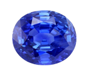
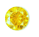

# ARRR Don't Lose Your Gems!


It's tough being a clumsy pirate. You trip and fall all the time, your parrot flies into things, and occasionally (well, more than just occasionally) you even lose your treasure. Because of all of this, we have to be super careful so Blackbeard doesn't get even more mad at us. We were just sent on a mission to pick up some treasure found on the shore of a deserted island. Let's make sure we get all the gems in our treasure chest!


## Let's Get Started

### Step 1:

Click `Open` at the top of this page to bring this lesson down so you can edit files in Nitrous.


### Step 2:

Open `index.html` in the browser by running in terminal `python -m SimpleHTTPServer 3000`. 

Once you have the server running, select `preview` and then `port 3000`.


You're going to code your solution in `css/gems.css`. Go ahead and open that file in the Nitrous text editor, as well as `index.html`.

### Move the Ruby


Obviously we want to go for the biggest gem first. As a pirate, there is always the risk of attack by enemy ships. Time is always of the essence, and the ruby is the biggest stone. 

If you take a look in `index.html`, you'll notice that the `img` tag has an ID `ruby`. We want to use that ID as our CSS selector to move the Ruby from the sand to the treasure box.

In `css/gems.css`, you'll want to replace the text `/*selector for ruby goes here */` with `#ruby`. `#ruby` is our CSS selector. The `#` signifies an ID. This selector is telling our CSS to find the content with the id `ruby` and to apply the specific styling listed between the curly brackets.

```css
#ruby {
  position: absolute;
  z-index: 1;
  top: 315px;
  left: 175px;
}
```

Save the changes to `css/gems.css` and refresh in the browser. You should have put the ruby in the chest. &#10003;

### Move the Emerald


Emeralds are pretty expensive so we should probably collect that gem next.

If you look at the code in `index.html`, the `img` tag for the emerald has the class `emerald` defined, instead of an ID. We want to use that class as our CSS selector to move the emerald into the chest. Remember that classes can be used repeatedly in our code, so this would come in handy if there were several emeralds on the beach. We're just getting used to writing different selectors right now, so we're only going to have one emerald.

In `css/gems.css`, you'll want to replace the text `/*selector for emerald goes here */` with the CSS selector, `.emerald`. The `.` tells CSS we're selecting a class. This selector is telling our CSS to find the content with the class `emerald` and to apply the specific styling to that image.

Save the changes to `css/gems.css` and refresh in the browser. Emerald done. &#10003;


### Move The Sapphire


The sapphire is going to be pretty tricky to move. There aren't any IDs or classes defined on the `img` tag. But, if you look carefully, you'll notice the `img` tag linking the sapphire is nested inside of a `div` with the id `sand`. This `img` tag is known as a child element of the parent, which is the `div`. 

```html
    <div id="sand">
      
    </div>

```

In order to select the sapphire image in our CSS, we can use what's called a descendant selector. In `css/gems.css` you'll want to replace the text `/*selector for sapphire goes here */ ` with `#sand img`. 

`#sand img` is our CSS selector. This selector will first look for an HTML tag with the ID `sand`, and from there, look for the `img` child HTML element, and apply that styling to the `img`.

Save your changes and refresh in the browser. Sapphire.  &#10003;

### Move The Yellow Diamond


Everyone loves a good yellow diamond, so let's make sure we get that gem into our treasure chest. Again, we have a tricky situation. There is no ID or class on the `img` tag, and it's not even nested inside of another div, meaning it's not a child element. 

If you look a little more closely, you'll notice the `img` tag with the yellow diamond is right next to a `div` with the id `ocean`. This `div` and `img` tag are known as sibling elements.

```html
<div id="ocean"></div>

```

We can use a sibling CSS selector to move the yellow diamond. In `css/gems.css`, replace the text `/*selector for yellow diamond goes here */ ` with `#ocean + img`. This CSS selector will first look for an HTML tag with the id `ocean`, and then for an `img` tag immediately following. 

Save your changes and refresh in the browser. Yellow diamond complete. &#10003;

### Move the Diamond


We saved the hardest for last, this way if we get attacked now, we can run away with four gems instead of just one. The diamond doesn't have any ID's, classes, parent tags, or siblings. The only thing that is unique to the diamond is the `alt` attribute. 

For an `img` tag, the `alt` attribute is "alternate text", which is text that will be displayed in the event that the image can't be loaded. We can use a CSS attribute selector to select the diamond.

In `css/gems.css`, replace the text `/*selector for diamond goes here */ ` with `img[alt="Diamond"]`. This CSS selector is going to look for an `img` tag that has an `alt` attribute that is storing the text `Diamond`. We only have one `img` tag with that `alt` text, so we're good to go!

Save your changes and refresh in the browser. Diamond done.  &#10003;

## Done and Done

Lastly, you need to enter in terminal in Nitrous `learn submit`. This command will push your work to GitHub and mark this lesson as complete in Learn!

## Share Share Share!
Show of your work by taking a screenshot of your filled treasure box or code and share with **\#flatironcodeclub** and **\#dontloseyourgems**

## Reminder 

Don't forget to shut down your server by hitting `control` and `c` before you move on to other material!

<p data-visibility='hidden'>View <a href='https://learn.co/lessons/hs-coding-club-css-selectors' title='ARRR Don't Lose Your Gems!'>ARRR Don't Lose Your Gems!</a> on Learn.co and start learning to code for free.</p>
